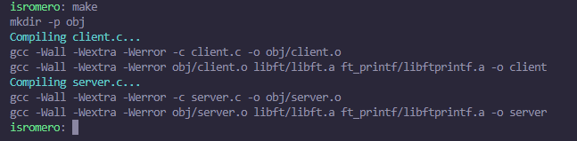
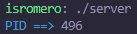
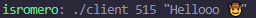
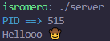
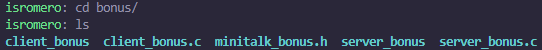
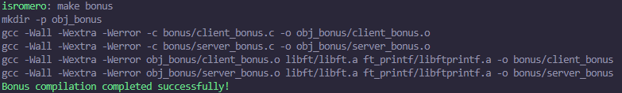
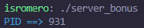
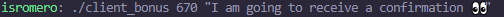
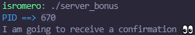
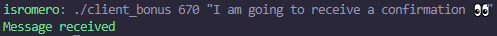

# minitalk
The purpose of this project is to code a small data exchange program using UNIX signals. It is an introductory project for the bigger UNIX projects that will appear later on in the cursus.

#### The goal of this project is:
  - To create two executables named: server and client.
  - The client will send information (a string) to the server, using UNIX signals.
  - The server must correctly receive and interpret this information, then display it.

#### Specific rules of the project:
   - The executables must be named client and server.
   - You can provide a Makefile, which will compile the source files of your program. Can't do relink.
   - You can use libft project.
   - You must handle errors carefully. Under no circumstances your program may terminate unexpectedly (segfault, bus error, double free, etc).
   - Your program cannot have memory leaks.
   - You can use one global variable per program (one for the client and one for the server), but you will have to justify its use.
   - In the mandatory part you are allowed to use the following functions:
      - write
      - ft_printf and whatever equivalent YOU have programmed
      - signal
      - sigemptyset
      - sigaddset
      - sigaction
      - kill
      - getpid
      - malloc
      - free
      - pause
      - sleep
      - asleep
      - leave

## Usage

- Inside of the folder you have to do 'make' to compile everything:

  

- Then you execute './server':

  

- With the pid of the server you execute './client [PID] [MESSAGE]':

  

- Server receives the message:

  

## Usage bonus

- Use cd to the folder '/bonus': 

  

- Inside of the folder you have to do 'make bonus' to compile everything:

  

- Then you execute './server_bonus':

  

- With the pid of the server you execute './client_bonus [PID] [MESSAGE]':

  

- Server receives the message:

  

- Client receives a confirmation:

  

## Signals? What is that?
***Signals are a form of communication between processes*** used by Unix-like systems
and those respecting the POSIX standards. ***Signals can be defined as a message***,
an event or an interrupt. When a process receives a signal, the process will
stop what its doing and ***take some action***.

In the context of the Minitalk project, signals are used to transmit messages
between processes using the minitalk communication protocol.

### A visual representation made by [42-cursus.gitbook-guide](https://42-cursus.gitbook.io/guide/rank-02/minitalk/understand-minitalk) :
  

Looking at this visual representation maybe you are asking: how can I transform my chars into bits for display the correct message? That's where the concept of bit shifting✨ comes in.

## Bitwise operations in C
For understanding correctly the bit shifting you have to know every operation possible(you will not use everything, but it is fine to know about all) and their operator:

In the C programming language, operations can be performed on a bit level using bitwise operators.

Bitwise operations are contrasted by byte-level operations which characterize the bitwise operators' logical counterparts, the AND, OR, NOT operators. Instead of performing on individual bits, byte-level operators perform on strings of eight bits (known as bytes) at a time. The reason for this is that a byte is normally the smallest unit of addressable memory (i.e. data with a unique memory address).

This applies to bitwise operators as well, which means that even though they operate on only one bit at a time they cannot accept anything smaller than a byte as their input.

### Bitwise operators

| Symbol | Operator |
| :---: | :---: |
| & | bitwise AND |
| \| | bitwise inclusive OR |
| ^ | bitwise XOR (exclusive OR) |
| << | left shift |
| >> | right shift |
| ~ | bitwise NOT (one's complement) (unary) |

### Logical VS Bitwise

| Bitwise | Logical |
| :---: | :---: |
| a & b | a && b |
| a \| b | a \|\| b |
| a ^ b | a != b |
| ~a | !a |

### Shift operators (Read and practice until you are comfortable with it)

#### Right shift (>>):
The right shift operator is denoted by '>>'. It takes two operands: the bit pattern (an integer) and the number of positions you want to shift the bits to the right. When you perform a right shift, you are effectively dividing the number by 2 to the power of the specified shift count and discarding the remainder. With right shift you put zeros on left.
Example:
  ```
  int i = 14; // Bit pattern 00001110
  int j = i >> 1; // Here, we shift the bit pattern by 1 position to the right, resulting in 00000111 = 7, which is 14 divided by 2.
  ```
The right shift operation is equivalent to performing integer division by 2 to the power of the specified shift count. So, for each right shift by n positions, the number is effectively divided by 2^n.

#### Left shift (<<)
The left shift operator is denoted by '<<'. Like the right shift, it also takes two operands: the bit pattern (an integer) and the number of positions you want to shift the bits to the left. When you perform a left shift, you are effectively multiplying the number by 2 to the power of the specified shift count. With left shift you put zeros on right.
Example:
  ```
  int i = 14; // Bit pattern 00001110
  int j = i << 1; // Here, we shift the bit pattern by 1 position to the left, resulting in 00011100 = 28, which is 14 multiplied by 2.  
  ```

The left shift operation is equivalent to performing multiplication by 2 to the power of the specified shift count. So, for each left shift by n positions, the number is effectively multiplied by 2^n.

### Bitwise assignment operators (Read and practice until you are comfortable with it)

| Symbol | Operator |
| :---: | :---: |
| &= | bitwise AND assignment |
| \|= | bitwise inclusive OR assignment |
| ^= | bitwise exclusive OR assignment |
| <<= | left shift assignment |
| >>= | right shift assignment |

#### &= (bitwise AND assignment)
The '&=' operator combines the bitwise AND operation with the estimate. That is, it takes the value of the variable on the left, performs a bitwise AND operation on the value of the variable on the right, and then assigns the result back to the variable on the left.
Example:
  ```
  int x = 10; // Binary representation: 00001010
  int y = 6;  // Binary representation: 00000110
  x &= y;     // Performs x = x & y
  ```
Result:
  ```
  // Binary AND operation between 00001010 (x) and 00000110 (y)
  // Compares each bit, if both bits are 1, the result bit is 1, otherwise, it's 0
  // Only the second bit from the right has a common 1 between x and y
  // Therefore, x is updated to 00000010 in binary, which is 2 in decimal.
  // x = 2
  ```

#### |= (bitwise OR assignment)
The bitwise inclusive OR assignment operator, |=, performs a bitwise OR operation between the left and right operands and assigns the result back to the left operand.
Example:
  ```  
  int x = 10; // Binary representation: 00001010
  int y = 6;  // Binary representation: 00000110

  x |= y;     // Performs x = x | y
  ```
Result:
  ```
  // Binary OR operation between 00000101 (x) and 00001001 (y)
  // Compares each bit, if at least one of the bits is 1, the result bit is 1, otherwise, it's 0
  // The first, third, and fourth bits have at least one 1 between x and y
  // Therefore, x is updated to 00001101 in binary, which is 13 in decimal.
  // x = 13
  ```

#### ^= (bitwise exclusive OR assignment)

The '^=' operator combines the bitwise exclusive OR (XOR) operation with the assignment. It takes the value of the variable on the left, performs a bitwise XOR operation on the value of the variable on the right, and then assigns the result back to the variable on the left.
Example:
  ```
  int x = 6; // Binary representation: 00000110
  int y = 3; // Binary representation: 00000011
  x ^= y;    // Performs x = x ^ y
  ```
Result:
  ```
  // Binary XOR operation between 00000110 (x) and 00000011 (y)
  // Compares each bit, if both bits are different (one 0 and one 1), the result bit is 1, otherwise, it's 0
  // The first and second bits have different values between x and y
  // Therefore, x is updated to 00000101 in binary, which is 5 in decimal.
  // x = 5
  ```

#### <<= (left shift assignment)
The '<<=' operator combines the left shift operation with the assignment. It takes the value of the variable on the left, shifts its bits to the left according to the value of the variable on the right (the number of positions), and then assigns the result back to the variable on the left.

Example:
  ```
  int x = 5; // Binary representation: 00000101
  x <<= 2;   // Performs x = x << 2
  ```
Result:
  ```
  // Left shift operation on 00000101 (x) by 2 positions
  // The bits are shifted two positions to the left, and zeros are filled in from the right
  // Therefore, x is updated to 00010100 in binary, which is 20 in decimal.
  // x = 20
  ```

#### >>= (right shift assignment)
The '>>=' operator combines the right shift operation with the assignment. It takes the value of the variable on the left, shifts its bits to the right according to the value of the variable on the right (the number of positions), and then assigns the result back to the variable on the left.
Example:
  ```
  int x = 16; // Binary representation: 00010000
  x >>= 2;    // Performs x = x >> 2
  ```
Result:
  ```
  // Right shift operation on 00010000 (x) by 2 positions
  // The bits are shifted two positions to the right, and zeros are filled in from the left
  // Therefore, x is updated to 00000100 in binary, which is 4 in decimal.
  // x = 4
  ```

## Pseudocode of my code to start coding
With the above concepts you may be a bit lost, so here is something that may help you:

In the minitalk code, bitwise operators and signal handlers (`sigaction`) are used to implement a simple communication between two processes: a client and a server. The communication between the client and server is achieved by sending ASCII character messages from one process to the other using `SIGUSR1` and `SIGUSR2` signals.

The client sends text messages to the server, and the server receives and displays these messages in the console. Here's the explanation of how bitwise operators and signals are used in the minitalk code:

**Client (`client.c`):**

- The `send_message` function is responsible for sending a character to the server via signals. This function takes the server's PID and the character to be sent as arguments.

- Inside the `send_message` function, a loop is used to send the character bit by bit. Each bit of the character is traversed using a mask and the bitwise AND (`&`) operation to check if the bit is 1 or 0.

- If the bit is 1 (`(i & (0x01 << bit)) != 0`), the `SIGUSR1` signal is sent to the server using the `kill` function.

- If the bit is 0 (`(i & (0x01 << bit)) == 0`), the `SIGUSR2` signal is sent to the server using the `kill` function.

- After sending each bit, a small pause is introduced using `usleep(500)` to ensure that the server has time to process the signal before sending the next bit.

- The client also sends a newline character (`'\n'`) at the end of the message to indicate to the server that it has finished sending the message.

**Server (`server.c`):**

- The `handle_sig` function is the signal handler that processes the `SIGUSR1` and `SIGUSR2` signals sent by the client.

- When a `SIGUSR1` signal is received, the handler updates the corresponding bit in the `data.i` variable using the bitwise OR (`|`) operation. This is done by shifting a 1 at the position of the received bit and then combining it with the current value of `data.i`.

- If a `SIGUSR2` signal is received, no action is needed because the bit is already set to 0 by default.

- When all 8 bits of a complete character have been received, the handler prints the corresponding character to the console using `putchar`, and then resets the `data.i` and `data.bit` variables to process the next character.

- The server also uses the `pause()` function to passively wait for signals. This prevents the server from consuming unnecessary CPU resources while waiting for signals.

In summary, the client sends text messages to the server through signals, sending a character bit by bit. The server receives and assembles complete characters from the received bits and displays the complete messages in the console. Bitwise operators (`&` and `|`) are used to handle the character bits, and the `SIGUSR1` and `SIGUSR2` signals are used for communication between the client and server.